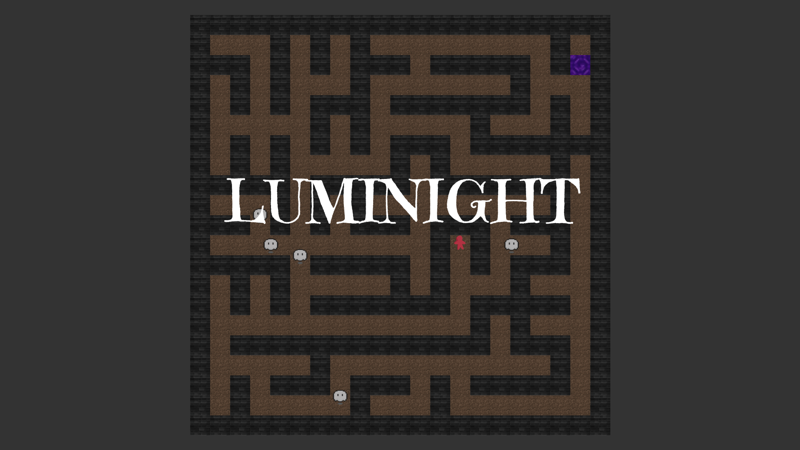

# Luminight

A simple maze game where you try to locate a portal in darkness while also running from ghosts

# References

- https://weblog.jamisbuck.org/2011/1/10/maze-generation-prim-s-algorithm
- https://www.reddit.com/r/Minecraft/comments/13idfgt/nether_portal_gif_i_got_it_from_the_game_files/
- https://fonts.google.com/specimen/Emilys+Candy
- https://www.youtube.com/watch?v=mF3ROkKc084
- https://www.geeksforgeeks.org/dsa/binary-heap/
- https://en.wikipedia.org/wiki/Dijkstra%27s_algorithm
- https://agusstt.itch.io/tiny-ghost-animated
- https://pucci-games.itch.io/stones-brick-textures
- https://opengameart.org/content/tileable-200x200-dirt-texture
- https://siege.hackclub.com/assets/meeple/meeple-red-94f33c30.png
- https://pixabay.com/sound-effects/howling-ambient-with-a-beat-59772/

Many of the downloaded textures were downscaled and/or cropped but otherwise unchanged
